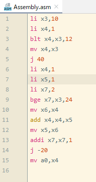
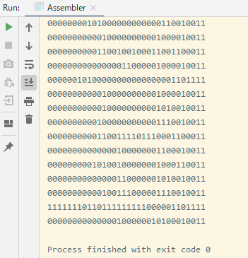
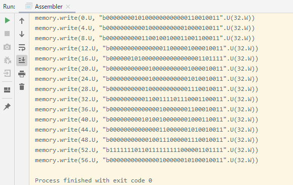

# myAssembler_RISCV
ScalaによるRISC-Vのアセンブリを機械語にするプログラム。

## 概要
RV32Iのアセンブリを機械語に翻訳するプログラム。
未実装の命令がいくつかある。
このプログラムでは、

上のようなRV32Iのアセンブリを

このように機械語に変換できる。また、

このような出力にしてそのままChiselコードとして使えるような出力にもできる。

## 始め方
このリポジトリをクローンして、IntelliJ IDEAでそのフォルダを開くとすぐに使える。

## 使い方
Assembly.asmに実行したいAssemblyをRV32Iで書く
/src/main/scala/Assembler/Assemblerが実行ファイルなのでこれを実行する。
そうすると、Assembly.asmに書いていたアセンブリがコンソールに出力される。
